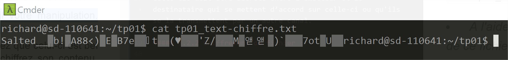

# Richard MONTOUX
_EPSI BORDEAUX I5_

# Manipulation des grands principes de la cryptographie
###### Utilisation de OpenSSL

### Questions:

##### 3.1.1 Rappels théoriques:

<li style="color:#5F7F79">_Expliquez moi à quoi peut servir une fonction de hachage ? Dans le cas du téléchargement d'un fichier sur un site internet, quel risque cela permet-il de prévenir ?_</li>

Une fonction de hachage peut servir principalement à hacher des données afin de les condenser. Ce condensé est de taille fixe et sa valeur diffère suivant la fonction utilisé.
Lors d'un téléchargement, afin de vérifier si le fichier n'a pas été altérer, il suffit de contrôler la valeur du hash du fichier télécharger et la même que le fichier source.

##### 3.1.2 Contrôle d'intégrité d'un téléchargement:
 <li style="color:#5F7F79">_Téléchargez depuis le site internet officiel3 la dernière version de GNUPG pour linux._</li>

``
wget https://gnupg.org/ftp/gcrypt/gnupg/gnupg-2.2.0.tar.bz2
``

 <li style="color:#5F7F79">_A l'aide de OpenSSL et de l'empreinte SHA1 de l'archive de GNUPG, affichée sur son site officiel5, vérifiez que le fichier n'a pas été altéré pendant le téléchargement. Comment avez vous procédé ? Expliquez en détail vos manipulations._</li>

Afin de vérifier que le fichier n'a pas été altéré, je vérifie la clé SHA1 du fichier source avec le fichier téléchargé.
Pour ce faire, j'utilise la commande openssl avec comme option __dgst [digest]__ qui permet de définir l'algorithme utilisé, ici on aura sha1.

``
openssl dgst -sha1 gnupg-2.2.0.tar.bz2
``

##### 3.2.1 Rappels théoriques :

<li style="color:#5F7F79">_Rappelez moi les grands principes du chiffrement symétrique_</li>

Le chiffrement symétrique permet de chiffrer et de déchiffrer un contenu avec la même clé.
Cette clé doit être secrète entre l’émetteur et le destinataire qui se mettent d’accord sur celle-ci ou qu'ils se la transmettent par un autre canal.

##### 3.2.2 Chiffrement de fichier :

<li style="color:#5F7F79">_A partir de votre éditeur de texte favori générez un fichier simple contenant le texte de votre choix_</li>

``
vim tp01_text.txt
``

<li style="color:#5F7F79">_A l'aide de OpenSSL chiffrez le contenu de ce fichier. Expliquez en détail votre manipulation. Transmettez ensuite ce fichier à votre voisin, puis la clef utilisée pour le chiffrer_</li>

Afin de chiffrer le fichier avec openSSL, j'ai utilisé cette commande:

``
openssl enc -e -aes-256-cbc -in tp01_text.txt -out tp01_text-chiffre.txt
``

Cette commande me permet d'encrypter le fichier avec le permamètre __enc__ qui permet de dire que l'on va utiliser un algorithme de chiffrement suivi de __-e-__ qui définit qu'il s'agit d'un fichier à chiffrer et suivi par l'algorithme d'encrytage.
Ensuite, je récupère le fichier en entré ave __-in__ et le nom que je lui donne en sorti __-out__.

<li style="color:#5F7F79">_Votre voisin vous aura transmis un fichier chiffré. Éditez son contenu et constatez que celui-ci est bel et bien chiffré. A l'aide de la clef que vous aurez reçue avec ce fichier, déchiffrez son contenu. Expliquez en détail vos manipulations. Vérifiez avec votre voisin que le contenu que vous avez obtenu est bien celui qu'il a rédigé au départ._</li>

Cette première image montre bien que le fichier est encrypter.

Afin de pouvoir le lire, je vais utiliser la commande suivante :
``
openssl enc -d -aes-256-cbc -in tp01_text-chiffre -out tp01_text-dechiffre.txt
``

Grace à cette commande je lui dit que l'on va utiliser un algorithme de chiffrement.
Puis on utilise le paramètre -d pour lui indiquer que l'on va déchiffrer un fichier.

Le fichier est bel et bien déchiffré.

### 3.2.2 Manipulation des protocoles de chiffrement asymétrique :

##### 3.2.2 Rappels théoriques :

<li style="color:#5F7F79">_Rappelez moi les deux applications principales du chiffrement asymétrique. Expliquez leurs principes de fonctionnement respectifs._</li>

__Chiffrement:__

Opération qui consiste à transformer un message à transmettre, dit « message clair », en un autre message, inintelligible pour un tiers, dit « message chiffré », en vue d'assurer le secret de sa transmission

__Signature numérique:__

Signature reposant sur un système de chiffrement à clé publique et clé privée permettant d'authentifier l'émetteur d'un document. La clé privée sert à signer, la clé publique sert à vérifier cette signature. La signature électronique est l'équivalent numérique de la signature manuscrite.

##### 3.2.2 Préparation de la biclef :

<li style="color:#5F7F79">_Générez pour chacun d'entre vous une paire de clefs RSA 2048bits. Repérez le répertoire où sont stockées vos clefs, puis sauvegardez les._</li>

Génération de la clé privée RSA 2048:
``
openssl genrsa -out rsa.key 2048
``

Génération de la clé publique RSA 2048
``
openssl rsa -in rsa.key -pubout > rsa.pub
``

<li style="color:#5F7F79">_Pour communiquer avec un interlocuteur vous allez devoir transmettre une de vos clefs. De laquelle s'agit-il ? Échangez alors cette clef avec toutes les personnes avec qui vous allez vouloir communiquer._</li>

Afin de communiquer avec un interlocuteur, je vais transmettre la clé publique. C'est grâce à celle-ci que l'interlocuteur va pouvoir déchiffrer mon message que j'aurais chiffré avec ma clé privée.

##### 3.3.3 Chiffrement et déchiffrement de fichiers :

<li style="color:#5F7F79">_A l'aide de la clef adéquat, chiffrez un fichier texte, à destination d'un interlocuteur précis. Vérifiez à l'aide d'un éditeur le contenu du fichier obtenu. Transmettez le à l'un de vos interlocuteur._</li>

Je vais chiffré mon fichier avec la clé publique de mon interlocuteur grâce à la commande suivante:

Je commance par utiliser un utilitaire RSA __rsautl__ suivi du paramètre __pubin__ qui définie le fichier d'entrée de type RSA avec __encrypt__ pour dire que l'on va chiffrer le message qui est __in__ dans le fichier source et qu'en sortie, nous voulons le nom du fichier suivant.

``
openssl rsautl -pubin -inkey ../rsa.pub  -encrypt -in tp01_text.txt -out tp01_text_rsa.txt.crypted
``

Si j'effectue un cat cela me donne :

<li style="color:#5F7F79">_Récupérez un fichier chiffré par l'un de vos interlocuteur, puis déchiffrez le à l'aide de la clef adéquat._</li>

Lorsque mon interlocuteur va recevoir mon fichier chifrré avec sa clé publique, lui seul pourra le déchiffrer avec sa clé privée. Pour cela, il va utiliser la commande suivante:

En revanche, pour qu'il puisse déchiffrer le fichier, il doit remplacer __encrypt__ par __decrypt__.

``
 openssl rsautl -decrypt -inkey ../rsa.key -in tp01_text_rsa.txt.crypted -out tp01_text_rsa. txt.uncrypted
``

##### 3.3.4 Signature électronique :

<li style="color:#5F7F79">_A l'aide de la clef adéquat, signez un fichier texte. Transmettez ce fichier et sa signature à l'un de vos interlocuteur._</li>

Tout d'abord nous allons calculer l'empreinte avec la commande suivante:

``
openssl dgst -sha256 -out file_sign.txt.sha256 file_sign.txt
``

Maitenant nous allons signer l'empreinte grâce à la commande:

``
 openssl rsautl -sign -inkey ../rsa.key -in file_sign.txt.sha256 -out file_sign.txt.signed
``

<li style="color:#5F7F79">_Récupérez un fichier signé par un de vos interlocuteur, ainsi que sa signature. Vérifiez la signature qu'il vous aura transmise. Essayez avec la clef d'un autre interlocuteur puis avec la bonne clef._</li>

``
 openssl rsautl -verify -pubin -inkey ../rsa.pub -in file_sign.txt.signed -out file_sign.txt .verify
``

Nous allons maintenant regarder la différence grâce à la commande suivante:

``
diff fichier.txt.sha1 fichier.txt.verify
``

Après vérification nous avons bien la même empreinte:

